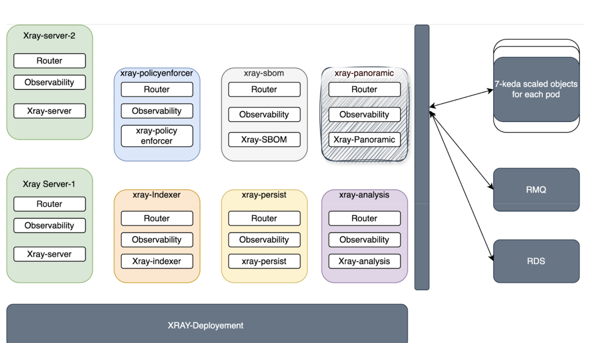

# Deploying JFrog Xray

To deploy JFrog Xray, you should create a new custom-values.yaml file with the following content and then pass it during installation with the Helm upgrade command.

```yaml
xray:
  enabled: true
```

## Configuring JFrog Xray

You can configure JFrog Xray with the following steps:

1. View the main `values.yaml` file and copy the configurations that you wish to update into a `custom-values.yaml` file.
2. Update the product configuration with custom values in the `custom-values.yaml` file. For the values not specified in the `custom-values.yaml` file, the default values from the main `values.yaml` of the chart will be used.
3. Run the upgrade command.

```console
helm upgrade --install jfrog-platform --namespace jfrog-platform --create-namespace jfrog/jfrog-platform  -f custom-values.yaml
```


## Installing Xray

### Pod Split ( Xray Version 3.124.x and above )

- Architecture:



- All Xray services are running as separate containers in dedicated pods.

#### Fresh Installation

1.  Set the below parameters to true

```bash
xray:
  enabled: true
  splitXraytoSeparateDeployments:
    fullSplit: true
```
2. Run the upgrade command.

```console
helm upgrade --install jfrog-platform --namespace jfrog-platform --create-namespace jfrog/jfrog-platform  -f custom-values.yaml
```

3. See the example custom values file here: [values-artifactory-xray.yaml](./values-artifactory-xray.yaml)


#### Upgrading from Monolith to Pod Split

To ensure a seamless upgrade from the monolith architecture to pod split, a two-step gradual upgrade process is required:

**Step 1 - Gradual Upgrade (Parallel Operation):**
Deploy the new pod split architecture alongside the existing monolith StatefulSet. During this phase, both architectures run simultaneously to ensure zero downtime. This allows the new deployment pods to initialize and become ready while traffic continues to be served by the existing monolith pod.

**Step 2 - Complete Migration:**
Once the deployment pods are stable and operational, remove the monolith StatefulSet to complete the migration. The system will now run exclusively on the pod split architecture with each Xray service in its dedicated pod.

##### Detailed Steps:

1. Set the below parameters to true. To prevent downtime, both the statefulset pod and deployment pods are kept together initially controlled by the `splitXraytoSeparateDeployments.gradualUpgrade` flag.

```bash
xray:
  enabled: true
  splitXraytoSeparateDeployments:
    fullSplit: true
    gradualUpgrade: true
```
2. Run the upgrade command.

```console
helm upgrade --install jfrog-platform --namespace jfrog-platform --create-namespace jfrog/jfrog-platform  -f custom-values.yaml
```

3. Set the `splitXraytoSeparateDeployments.gradualUpgrade` to false which will remove statefulset pod and only keep the deployment pods

```bash
xray:
  enabled: true
  splitXraytoSeparateDeployments:
    fullSplit: true
    gradualUpgrade: false
```

4. Run the upgrade command.

```console
helm upgrade --install jfrog-platform --namespace jfrog-platform --create-namespace jfrog/jfrog-platform  -f custom-values.yaml
```

5. See the example custom values file here: [values-artifactory-xray.yaml](./values-artifactory-xray.yaml)


## Autoscaling for Xray ( Pod Split )

1. By default, autoscaling is disabled for Xray services. 
2. To enable autoscaling, set the below values to true per service:

```bash
xray:
  enabled: true
# Enable autoscaling for all the individual microservices
  server:
    autoscaling:
      enabled: true

  analysis:
    autoscaling:
      enabled: true

  sbom:
    autoscaling:
      enabled: true

  policyenforcer:
    autoscaling:
      enabled: true

  indexer:
    autoscaling:
      enabled: true

  persist:
    autoscaling:
      enabled: true
```

3. Each Xray service comes with predefined minimum and maximum replica counts managed through autoscaling. To view or modify these defaults, refer to the values defined in `values.yaml` of the xray chart under `xray.<service>.autoscaling.minReplicas` and `xray.<service>.autoscaling.maxReplicas`. You can override these values in your custom values.yaml file as needed.

## Optional: KEDA for Queue-Based Autoscaling ( Pod Split )

KEDA-based scaling efficiently adjusts workloads based on queue length, ensuring microservices scale in response to actual message load rather than CPU or memory usage.

1. You can optionally install KEDA for queue-based autoscaling.
2. Install KEDA in your cluster. For detailed instructions and maintenance, refer to the KEDA documentation: https://keda.sh/docs/2.18/deploy/
3. After installing KEDA, enable it in the Xray charts under the autoscaling section:

```bash
xray:
  enabled: true
# Enable keda for all the individual microservices
  server:
    autoscaling:
      enabled: true
      keda:
        enabled: true

  analysis:
    autoscaling:
      enabled: true
      keda:
        enabled: true

  sbom:
    autoscaling:
      enabled: true
      keda:
        enabled: true

  policyenforcer:
    autoscaling:
      enabled: true
      keda:
        enabled: true

  indexer:
    autoscaling:
      enabled: true
      keda:
        enabled: true

  persist:
    autoscaling:
      enabled: true
      keda:
        enabled: true
```